## Wer bin ich?

::: notes
Ich stelle heute eine Lehreinheit aus dem Themenbereich "Digitale Bibliothek" vor.
Da mich die Meisten heute zum ersten mal erleben, möchte ich mich zunächst ganz kurz vorstellen.
:::

**Dr. Jakob Voß** (\*1979)

:::: {.columns}
::: {.column width=80%}
* Bibliothekswissenschaft\
  Informationswissenschaft\
  Informatik

* Lehrveranstaltungen & Fortbildungen

* Forschung & Entwicklung an der\
  Verbundzentrale des GBV (VZG)
:::
::: {.column width=20%}
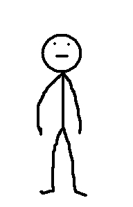{height=50%}
:::
::::

# Digitale Bibliotheken

::: notes
Bevor wir auf einen speziellen Teilaspekt digitaler Bibliotheken eingehen können, ist es sinnvoll
nochmal kurz zu klären, um was es sich bei digitalen Bibliotheken handelt.
:::

## Bibliotheken

:::: {.columns}
::: {.column width=50%}

\vbox to \parskip{}

dienen der

* *Sammlung*
* *Erschließung*
* *Bereitstellung*

von Dokumenten.
:::
::: {.column width=50%}
{width=85%}
:::
::::

## Digitale Bibliotheken

:::: {.columns}
::: {.column width=50%}

\vbox to \parskip{}

dienen der

* *Sammlung*
* *Erschließung*
* *Bereitstellung*

von **digitalen** Dokumenten.

\vbox to \parskip{}

*Etwas neues kommt hinzu...*

:::
::: {.column width=50%}
{width=85%}
:::
::::

## Bibliotheken für digitale Dokumente

Seit wann gibt es digitale Bibliotheken?

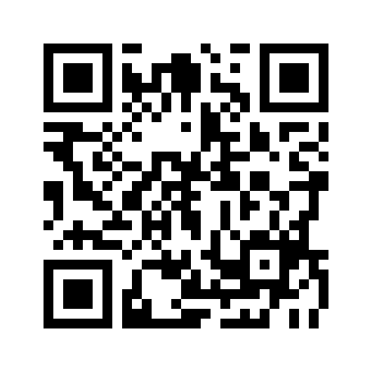{height=60%}

::: notes

* Auswahl-Frage, Jahrzehnt reicht.
* Daten gibt es schon früher als digitale Dokumente (z.B. Karteikarten)
* Wann wurden Dokument-Sammlungen Bibliotheken?
* *Moderne* Bibliotheken entstanden erst Mitte des 19. Jahrhunderts --
  wann gilt dies für digitale Bibliotheken?

:::

---

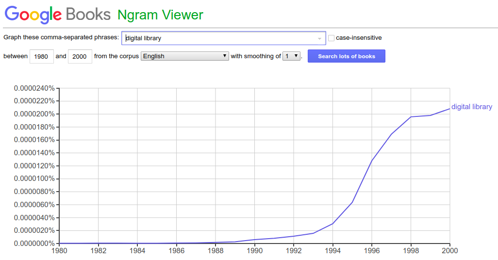

::: notes

Google Books ist selber eine digitale Bibliothek

:::

---

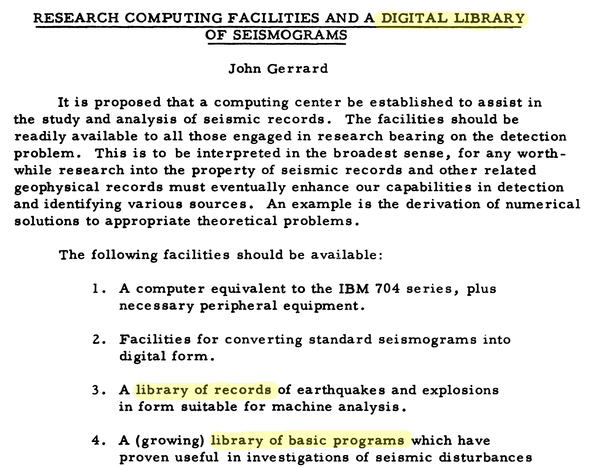{height=85%}

::: notes

* Erstes Proposal für eine konkrete digitale Bibliothek
* Umfasst
* Forschungsdaten-Repository und Virtuelle Forschungsumgebung

:::

---

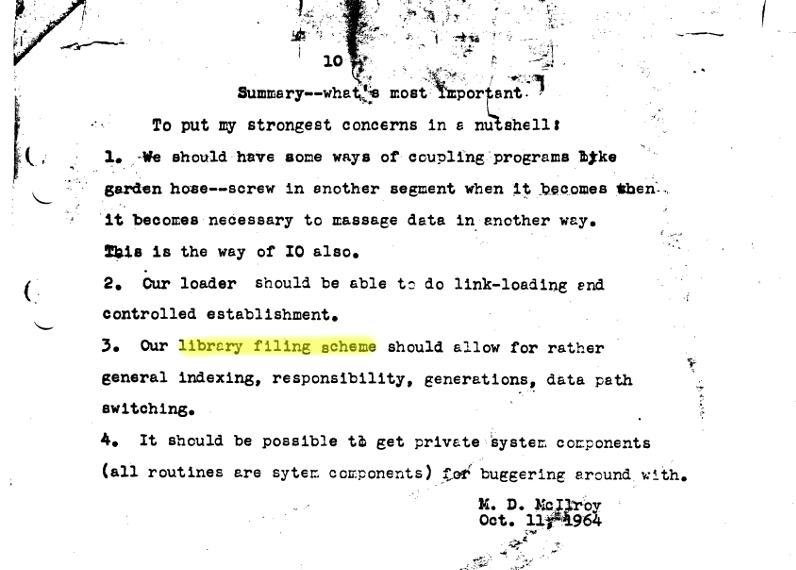{height=80%}

::: notes
 
1964 wurden Dateisysteme und Betriebssystemeim heutigen Sinne gerade erst
entwickelt.  Douglas McIlroy war einer der Wissenschaftler die Ende der 1960er
das Betriebssystem Unix entwickelten.

Statt dem erst später etablierten Begriff "file system" spricht McIlroy hier
allgemeiner und vorausschauend von "library filing scheme". Umgekehrt lassen
sich Dateisysteme und alle anderen strukturierten Sammlungen von digitalen
Dokumenten als Digitale Bibliotheken auffassen.

:::

::: notes

Damit wäre ganz grob geklärt was digitale Bibliotheken sind (Sammlungen von
digitalen Dokumenten aller Art: Publikationen, Audiovisuelle Medien,
(Forschungs)daten...), aber das ist nur ein Aspekt von Bibliotheken...

:::

## Bibliotheken

:::: {.columns}
::: {.column width=50%}

\vbox to \parskip{}

können als 

* *Sammlung*
* *Organisation*
* *Gebäude*

aufgefasst werden.

:::
::: {.column width=50%}

{width=85%}

:::
::::

## Digitale Bibliotheken

:::: {.columns}
::: {.column width=50%}

\vbox to \parskip{}

können als 

* *Sammlung*
* *Organisation*
* **Infrastruktur**

aufgefasst werden.

:::
::: {.column width=50%}
{width=85%}
:::
::::

::: notes

Bei digitalen Bibliotheken ist die Infrastruktur vor allem technische
Infrastruktur. Physische Bibliotheken müssen sich damit auseinandersetzen wie
Bibliotheksgebäude nutzbringend eingerichtet werden; digitale Bibliotheken
müssen sich mit technischer Infrastruktur auseinandersetzen. 

:::

## Technische Infrastruktur digitaler Bibliotheken

* Wie muss die technische Infrastruktur\
  für digitalen Bibliothek aufgebaut sein?

* Viele konkrete Techniken
    * Internet/WWW (HTML, URL, Webservices...)
    * Software (DSpace, EPrints, OPUS...)
    * Standards (OAI-PMH, OAIS, RDF...)

    *=> Eigene Lehreinheiten am praktischen Beispiel*\
    *=> Repositories und Archive*

* Wichtiger: Überblick von allgemeinen Möglichkeiten

::: notes

Bibliothekar*innne müssen nicht jede Technik beherrschen sondern
nur einen Überblick über grundsätzliche Möglichkeiten haben und
wissen welche Art von Technik wofür angewandt werden kann.

:::

# Nutzungsmöglichkeiten digitaler Dokumente

::: notes
Wir können digitale Dokumente allgemein genutzt werden?

Vor allem: welche allgemeinen Formen der Nutzung digitaler Dokumente
sind mit physischen Dokumenten nicht oder nur schwer möglich?
:::

---

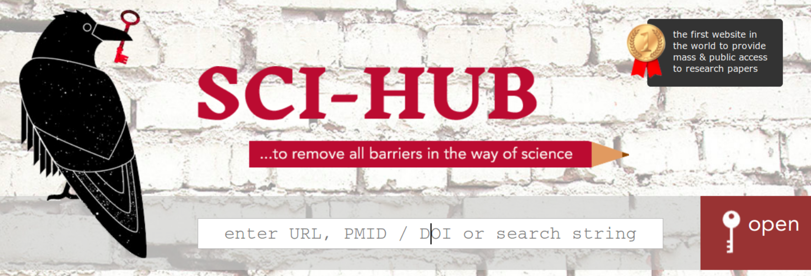{height=85%}

*=> Digitalität: Grundlegende Eigenschaften von Daten*

\vfill

Für reine Bereitstellung die primäre Eigenschaft!

::: notes
* Wenn es in digitalen Bibliotheken nur um Bereitstellung geht, wäre hier Schluss.
* Wie sci-hub zeigt, bräuchten wir dann aber auch keine Bibliotheken mehr.
* Gehen wir also davon aus dass digitale Bibliotheken mehr Nutzungsarten bieten sollen.
:::

---

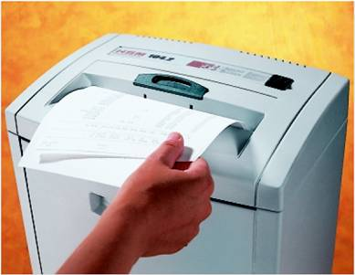{height=65%}

\vfill

*=> Information Retrieval*\
*=> Maschinelles Lernen in Digitalen Bibliotheken*

# Erweiterte Nutzungsarten von (digitalen) Dokumenten

::: notes
Nutzungsarten von Dokumenten, die schon immer gewollt sind, sich bei physischen
Dokumenten aber nur begrenzt umsetzen lassen.
:::

---

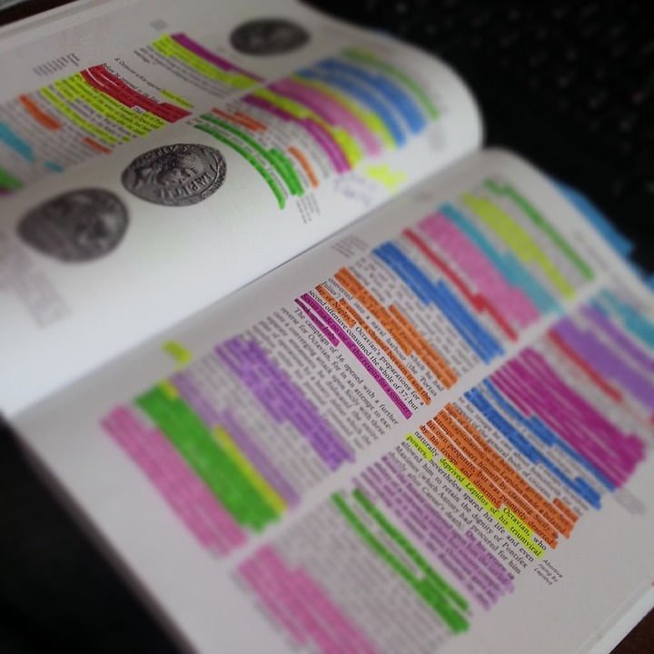{height=85%}

---

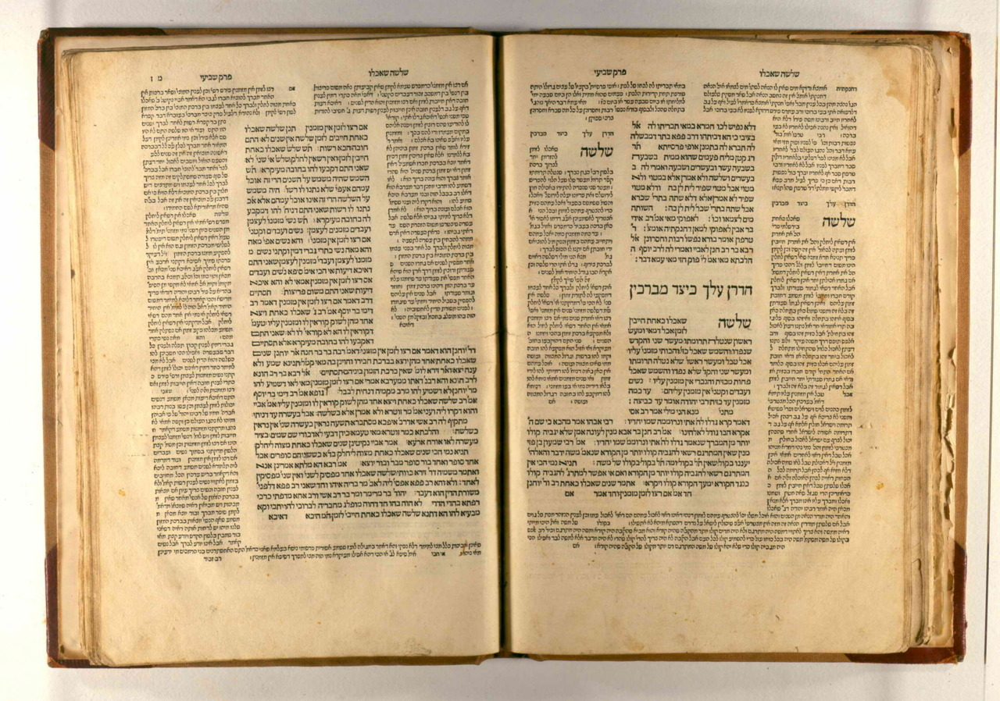{height=85%}

<!-- Erster Druck des Babylonischen Talmud -->

---

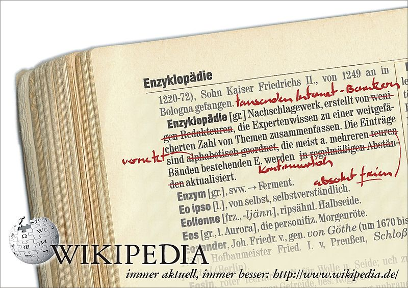{width=90%}

---

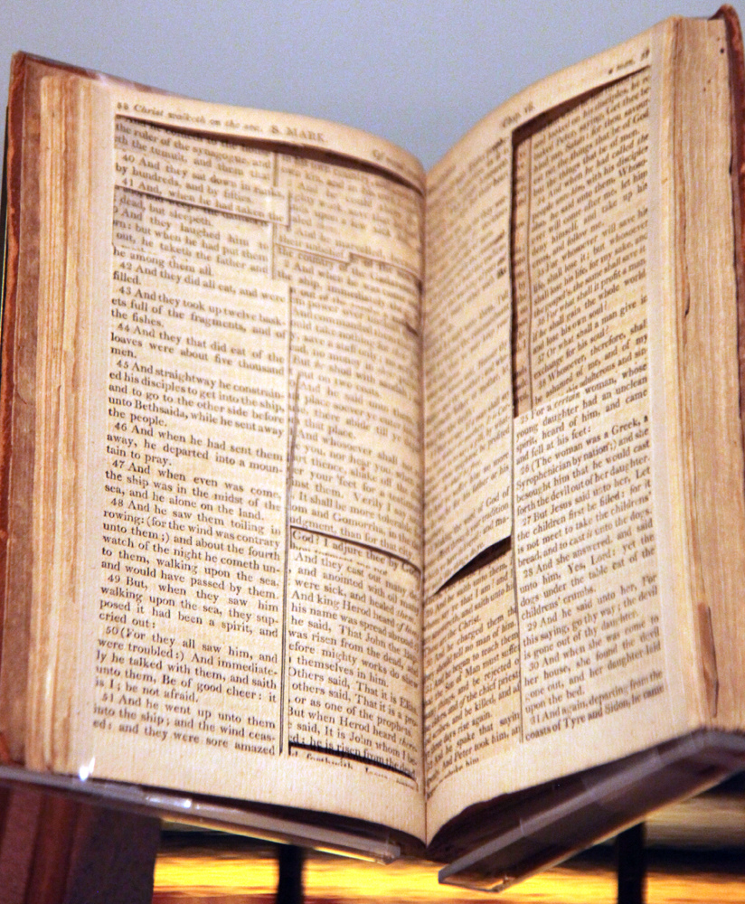{height=85%}

<!-- Quelle für die Bibel von Thomas Jefferson (3. US-Präsident und Haupt-Autor der Unabhängigkeitserklärung) -->

<!-- Vorteil gegenüber Copy & Paste! -->

---

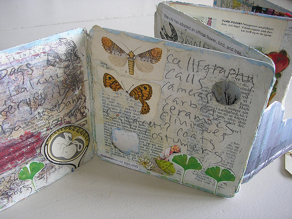{height=85%}

<!-- Kunst aus Büchern -->

## Anforderung an digitale Bibliotheken

* Annotation
* Überarbeitung
* Kopieren
* Kombination
* ...

::: notes
Wie können diese Anforderungen erfüllt werden? 
:::

. . .

Falsche Antwort: *Kaufen sie unsere Software!*

Richtige Frage: *Was haben diese Nutzungen gemeinsam?*

# Digitale Dokumente sind Hypertexte!

---

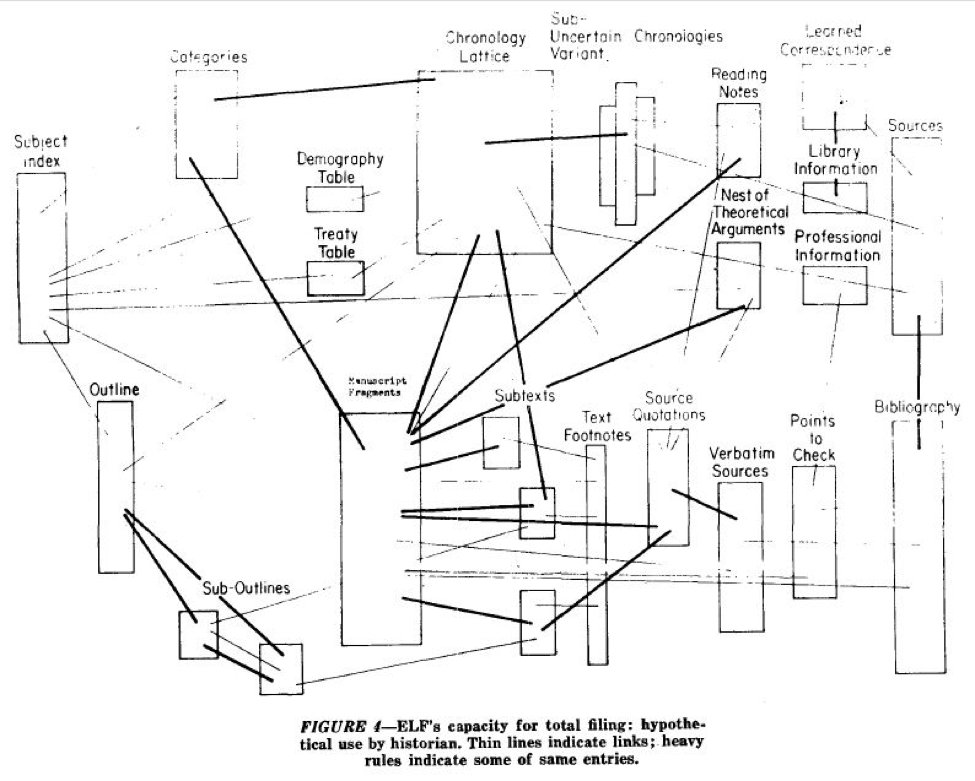{height=95%}

<!-- Bildquelle: Nelson 1965 -->

---

{height=85%}

<!-- Bildquelle: Nelson http://www.xanadu.com.au/ted/XUsurvey/xuDation.html -->

::: notes

Idee: Textstellen am Bildschirm markieren und in Beziehung setzen

Textstellen kopieren, korrigieren, anmerken...

:::

---

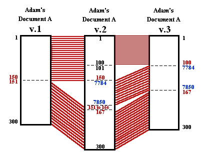{height=80%}

## Hypertext-Anwendungsbeispiele

:::: columns
::: column
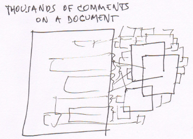
::: 
::: column
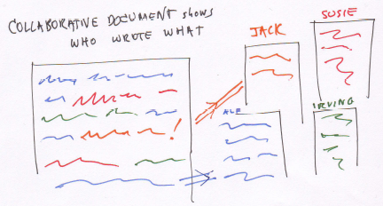
:::
::::

\vfill\centering
<http://transliterature.org/>

# Umsetzung durch Auswahl von Teildokumenten

::: notes

Kein Copy & Paste sondern Verweis aufs Original

Voraussetzung für Hypertext ist die Möglichkeit, Teil von Dokumenten zu referenzieren 

:::

## Fragment Identifier in HTML

[https://de.wikipedia.org/wiki/Bibliothek**#Geschichte**](https://de.wikipedia.org/wiki/Bibliothek#Geschichte)

\vfill

*=> Grundkurs HTML*

## URI Fragment Identifiers

* Standards und Konventionen je nach Dokumentformat

	* Sprungziel in HTML (`#target`)
	* Startseite in PDF (`#page=23`)
	* Plain Text Fragment Identifiers (`#line=12,15`)
	* ...

. . .

* [W3C Media Fragments](https://www.w3.org/TR/media-frags/)

	* Zeitliche Auswahl (Sekunden)\
	  **`t=20,83`**\
	  **`t=00:20,01:23`**

	* Örtliche Auswahl (Pixel)\
	  **`#xywh=0,0,20,80`**

## Verweis auf YouTube-Videoausschnitte

* [youtube.com/watch?v=e235JwmmEcQ**&t=20s**](https://www.youtube.com/watch?v=e235JwmmEcQ&t=20s)

* [youtube.com/embed/e235JwmmEcQ**?start=20&end=83**](https://www.youtube.com/embed/e235JwmmEcQ?start=20&end=83)

## Annotationen mit Hypothes.is

{height=30%}

*Siehe [Kurzdemo des Digital Writing & Research Lab, UTexas](https://www.youtube.com/embed/e235JwmmEcQ?start=20&end=83)*

::: notes
](img/marginalie.png)
:::

## International Image Interoperability Framework (IIIF)

\cornerimage[width=2cm]{img/iiif-logo.png}

* Internationale Community von Bibliotheken (seit 2011)

* Infrastruktur zur **Bereitstellung digitaler Bilder**

* Spezifikationen und Werkzeuge

---

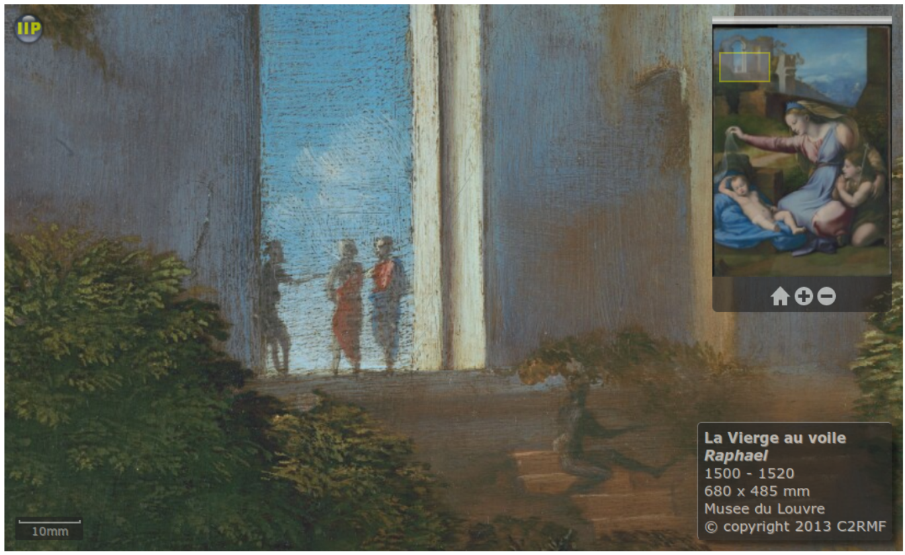

## IIF Image API Standard

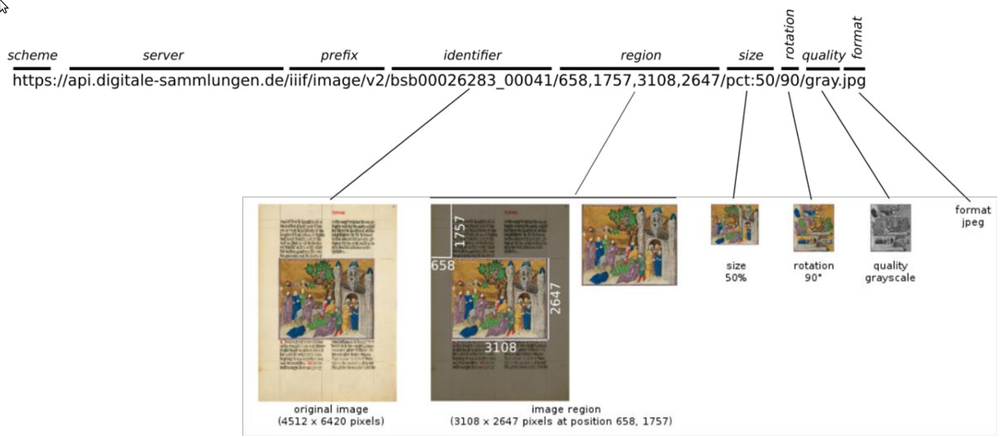

::: notes

Weitere Anwendungen von IIIF

* Bilder teilen und referenzieren
* Bilder/Ausschnitte über Sammlungsgrenzen hinweg vergleichen
* Bilder annotieren

Siehe IIIF Presentation API: Strukturdaten (Seitenannordung...):
Unterstützt Media Fragments Standard

Gute Beispiele: <https://www.slideshare.net/simeonwarner/iiif-tutorial-2017> slide 12/4

:::

## Selektionssprachen je nach Dokumentformat

Dokumentformat		Selektionssprachen
-------------------	---------------------------------
Bild				Media Fragments, IIIF Image API
Audio & Video		Media Fragments
Text				Plain Text Fragment Identifiers
CSV Tabelle			CSV Fragment Identifiers
XML					XPath, XPointer
HTML				CSS Selectors
...					...

\vfill

::: notes
* Jede Abfragesprache operiert auf einem Dokumentmodell
* Offene Entwicklung, noch nicht in Digitalen Bibliotheken etabliert umgesezt
* Siehe auch <https://www.w3.org/TR/selectors-states/> und Web Annotations
:::

# Zusammenfassung

## Zusammenfassung

* Digitale Bibliotheken
	* Jede strukturierte Sammlung von Daten
	* Benötigen technische Infrastruktur

. . .

* Nutzungsmöglichkeiten digitaler Dokumente
	* Kopieren und automatisch Weiterverarbeitung
    * Annotation, Überarbeitung, Remix...

## Zusammenfassung
    
* Dokumente als Hypertext
    * Verlinkung von Teildokumenten (*Transklusion*)
    * Ermöglicht Annotation, Überarbeitung, Remix...

. . .

* Auswahl von Teildokumente
	* Annotationen mit Hypothes.is
	* Verweise auf Video-Ausschnitte bei YouTube
	* W3C Media-Fragments und Fragment Identifier
	* Verweise auf Bildausschnitte mit IIIF
    * ...

## Verwandte Themen

* Referenzierung von Dokumenten

	*=> Identifier*

* Auffinden von Dokumenten

  	*=> Information Retrieval*

* Archivierung von Dokumenten

	*=> Repositories und Archive*

## Aufgaben für nächste Lehreinheit

1. Dokument annotieren mit Hypothes.is
2. Zwei Bildausschnitte vergleichen mit IIIF-Anwendung Mirador

## (Bild)quellen und Lizenzangaben {.allowframebreaks}

[*Stadtbibliothek San Giorgio*](https://commons.wikimedia.org/wiki/File:Biblioteca_pubblica._San_Giorgio_di_Pistoia.JPG):
[CC BY-SA 2.0],
[Giaccai\@Commons](https://commons.wikimedia.org/wiki/User:Giaccai)

*Research Computing Facilities and a Digital Library of Seismograms*: John Gerrard (1959)*

*Summary -- what's most important*: Douglas McIlroy (1964).
Digitalisiert von Dennis Ritchie

[*Paper shredder news*](https://commons.wikimedia.org/wiki/File:Paper_shredder_news.jpg): CC0

[*annotated-book.jpg*](https://pixabay.com/de/buch-lehrbuch-hochschule-lernen-845280/): CC0, Pixabay.

*Talmud, Berakhot, Venice*, 1520–1523, Printed by Daniel Bomberg, BM499 1520–1523 v.1, Fols. 46v–47r

[*Wikipedia_lexikon4.jpg*](https://commons.wikimedia.org/wiki/File:Wikipedia_lexikon4.jpg):
[CC BY-SA 3.0] André Darmochwal

[*Source bible for the Jefferson Bible*](https://www.flickr.com/photos/timevanson/7237098046):
[CC BY-SA 2.0], 
[Tim Evanson](https://www.flickr.com/photos/timevanson/)

[*Altered Book 2*](https://commons.wikimedia.org/wiki/File:Altered_Book_2.jpg):
[CC BY-SA 4.0],
[Heaven&Earth](https://commons.wikimedia.org/wiki/User:Heaven%26Earth)

Alle Hypertext-Abbildungen von Ted Nelson aus
[*Xanalogical Structure, Needed Now More than Ever*](http://www.xanadu.com.au/ted/XUsurvey/xuDation.html) (1999)
und [transliteratur.org](http://transliterature.org/)

IIIF Image API: Beispiel von Martin Baumgartner (BSB)

[CC BY-SA 4.0]: https://creativecommons.org/licenses/by-sa/4.0/legalcode
[CC BY-SA 3.0]: https://creativecommons.org/licenses/by-sa/3.0/legalcode
[CC BY-SA 2.0]: https://creativecommons.org/licenses/by-sa/2.0/legalcode
